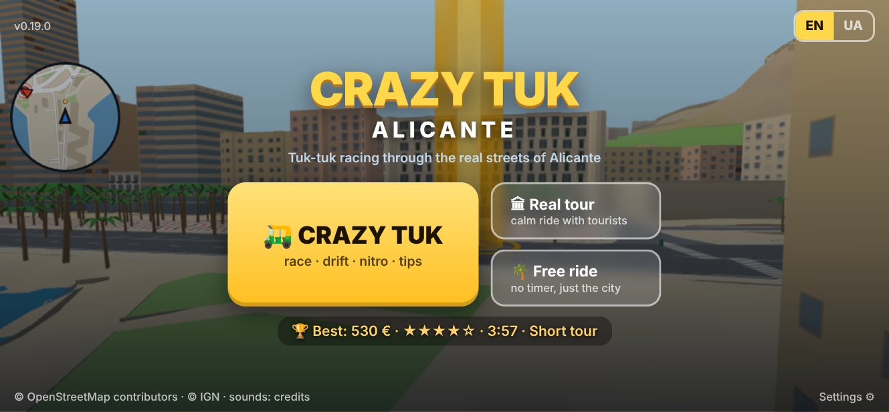
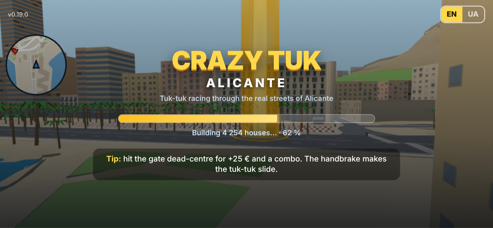
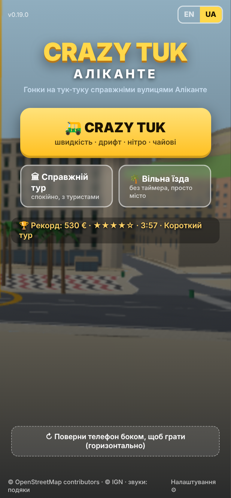
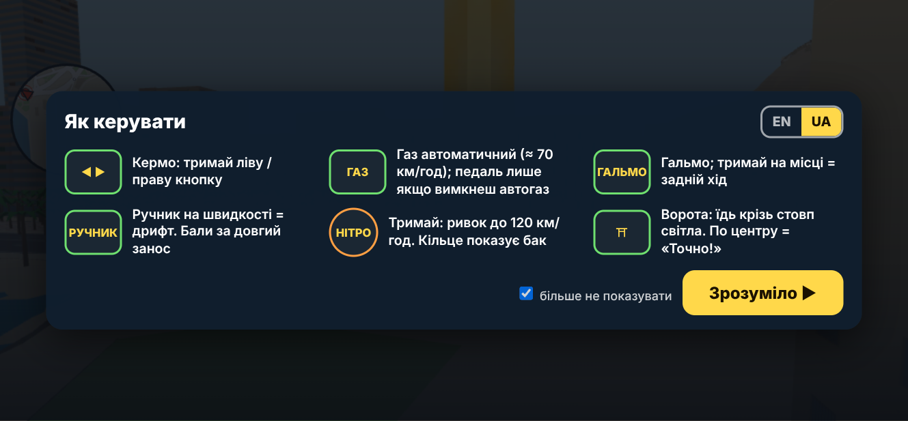

# План: вхід «як у справжній грі» (заставка, завантаження, підказка, меню для гостей, посилання, EN/UA, нітро 120)

Дата: 2026-10-10. База: 0.18.3. Статус: **план, код не пишеться, доки ти не погодиш.** Мої пропозиції позначено «пропоную», твої рішення вже враховано як дані.

Макети (статичні сторінки, зняті в браузері; фон: справжній кадр гри з Explanada; на макеті ще видно кружок мінікарти й стовп воріт із того кадру: у справжній заставці фон буде чистий):

| | |
|---|---|
|  заставка, телефон горизонтально, EN |  екран завантаження з прогресом і підказкою |
|  заставка вертикально, UA |  підказка першого запуску (один раз) |

## 1. Заставка (title screen)

**Що бачить гість, відкривши посилання:** спершу екран завантаження (розділ 2), потім заставка. Фон: **кадр міста** (Explanada з пальмами й Casa Carbonell, трохи затемнений донизу, щоб текст читався).
Пропоную два шари: поки місто вантажиться, лежить **статична картинка** (миттєвий перший кадр, ~150 КБ), а коли місто збудоване, за меню **повільно пливе живе 3D-місто** (камера ковзає над Explanada;
це той самий рендер, що й у грі, сцена вже в пам'яті, тож на FPS і батарею впливає лише поки відкрите меню). Якщо хочеш простіше: тільки статична картинка.

**Елементи (зверху вниз):**

- угорі зліва версія (`v0.19.0`, дрібно), угорі справа **перемикач мови EN | UA** (жовта та, що активна);
- **логотип**: «CRAZY TUK» великими жовтими літерами з тінню, під ним «ALICANTE» / «АЛІКАНТЕ» розрядкою, під ним один рядок: «Tuk-tuk racing through the real streets of Alicante» / «Гонки на тук-туку справжніми вулицями Аліканте». Пропоную текстовий логотип, без малюнка: він масштабується, перекладається і не потребує дизайнера. Іконка 🛺 з `assets/icons` може стояти перед назвою; скажи, якщо хочеш;
- **велика жовта кнопка «🛺 CRAZY TUK»** з підписом «race · drift · nitro · tips» / «швидкість · дрифт · нітро · чайові». Під нею дрібно (не на макеті): **який рівень** запуститься («Short tour ▾», тап відкриває список рівнів), пропоную саме так, щоб вибір рівня не ховався в налаштуваннях;
- поруч (горизонтально) або під нею (вертикально) дві менші напівпрозорі кнопки: **«🏛 Real tour / Справжній тур»** («calm ride with tourists») і **«🌴 Free ride / Вільна їзда»** («no timer, just the city»);
- **рядок рекорду**: «🏆 Best: 530 € · ★★★★☆ · 3:57 · Short tour» для рівня, що вибраний у кнопці Crazy Tuk (нема рекорду: «No record yet. Be the first!» / «Рекорду ще нема»);
- унизу зліва подяки (© OpenStreetMap, © IGN, звуки), унизу справа **«Settings ⚙ / Налаштування»**: відкриває висувну панель з тими самими рядками, що й зараз у стартовому екрані (автогаз, звук, музика, поле зору, роздільність, вібрація, нахил кабіни, VR-керування). Для гостя це на другому плані.
- **ПК**: та сама заставка (миша, Enter = Crazy Tuk). Таблиці клавіатури й Quest, які зараз на стартовому екрані, переїжджають у **«Help / Допомога»** (кнопка в Settings і в меню паузи), щоб перший екран був чистий. Кнопка **«Enter VR»** лишається видимою на ПК/Quest поруч із трьома кнопками, як зараз (три.js VRButton), текст її не перекладається (три.js), але це нормально.
- **Вертикально на телефоні** (макет справа): усе в стовпчик, велика кнопка на всю ширину, унизу пунктирна картка «↻ Поверни телефон боком, щоб грати». Пропоную **дозволити читати заставку вертикально**, а поворот вимагати лише при старті гри (зараз `rotateGuard` блокує все). При старті з вертикального положення: ми вже просимо повний екран і горизонталь (`lockLandscape`), це лишається.
- Редактор рівнів і «Звуки»: як і зараз, тільки з ключем (меню ≡ → …, на ПК E / L). На заставці їх нема.

**Анімація (дешево):** логотип з'являється з легким збільшенням 0.4 с, кнопка Crazy Tuk пульсує тінню раз на 2 с. Нічого щокадру в JS.

## 2. Екран завантаження

Зараз: стартова картка з кнопкою «Завантаження…», статус під нею («Малюю текстури…», «Завантаження міста…», «Будую N будинків…», «Компілюю шейдери…»); на S20 це 3–6 с, на ПК 2–3 с.

Пропоную:

- той самий фон і логотип, що на заставці (без кнопок), **смужка прогресу** й підпис етапу з відсотком. Відсотки за вагами етапів, виміряними на телефоні: текстури 5 %, завантаження `city.json` 10 % (за байтами, `fetch` з потоком: справжній прогрес),
  рельєф 5 %, будівлі 50 % (будуються пачками, прогрес за числом будинків, уже так рахується), фасади з фото й моделі 15 %, шейдери 10 %, звуки/рівні 5 %. Прогрес ніколи не йде назад і не стоїть на 100 % (останні 3 % лише після першого кадру);
- **підказки** в картці під смужкою, міняються кожні 3 с, EN/UA, 8–10 штук: «Ворота точно по центру: +25 € і комбо», «Ручник на швидкості = дрифт; довгий занос платить», «Нітро з місця теж працює», «Майже зачепив стіну на швидкості: плюс», «Розбиті конуси дають чайові», «У Справжньому турі туристи люблять плавність», «Це справжні вулиці Аліканте з OpenStreetMap»;
- коли все готове, смужка стає зеленою на 0.3 с і **заставка з кнопками з'являється сама** (кнопки не стоять «вимкненими» під час завантаження: гість не повинен бачити сіру кнопку).
- Технічно: той самий `status()` у `main.js` отримує ще число 0..1; `?autostart` і тести працюють як раніше.

## 3. Перший запуск: підказка керування

- Показується **один раз на пристрої** при першому старті **Crazy Tuk** (перед відліком 3-2-1), EN/UA за вибраною мовою; прапорець «більше не показувати» (за замовчуванням увімкнений); кнопка «Зрозуміло ▶» запускає відлік. Повторно: меню паузи → «Help / Допомога».
- Зміст (макет): кермо ◄ ►; газ автоматичний (педаль лише коли автогаз вимкнено); гальмо (тримати на місці = задній хід); ручник = дрифт; нітро (тримай, до 120 км/год, кільце = бак); ворота (крізь стовп світла, по центру = «Exact!»). На ПК замість кнопок клавіші (A D / W / S / Пробіл / Shift). У VR підказка не показується (там свій контроль, і текст у шоломі не читається).
- Пропоную додатково перші 20 с першого забігу показувати над кнопками маленькі стрілки-підказки «натисни» (нітро, ручник), коли гравець їх ще не торкався. Якщо зайве, скажи.

## 4. Меню паузи для гостей

Зараз у ≡ одна колонка дій (карта, повернути на дорогу, перецентрувати погляд, забіг заново, Crazy Tuk, вільна їзда, діагностика, повний екран, встановити) і друга колонка з усіма налаштуваннями.

Пропоную два рівні:

| Основне (видно одразу) | «Advanced / Додатково» (згорнуто, тап розкриває) |
|---|---|
| ▶ Продовжити · 🔁 Забіг заново · 🗺 Карта · 🏁 Рівень (список) · 🔊 Звук · 🎵 Музика · 🌐 Мова EN/UA · ❓ Допомога · 🏠 На головну (заставка) · ⛶ Повний екран | Автогаз, Камера (кабіна/ззаду), Нахил кабіни, Мінікарта, Поле зору, Роздільність, Вібрація, Погляд сам повертається, Перецентрувати погляд, Повернути на дорогу, Діагностика і звіт, Встановити як застосунок, Режим керування (поки лише «За столом») |

- «На головну» зупиняє забіг/тур і показує заставку (сцена лишається в пам'яті, тож повернення миттєве).
- Редактор рівнів і Звуки: у «Додатково», лише з ключем (як зараз).
- ПК: те саме меню по Esc (зараз Esc нема; клавіші-гарячі лишаються).

## 5. Посилання для друзів і картка-прев'ю

**Чому зараз у адресі з'являється `?v=…`:** це мій «захист від старого кеша» в `index.html`: якщо `version.json` новіший за сторінку з кеша, сторінка перезавантажується з `?v=<версія>`, щоб обійти кеш. Параметр лишається в адресному рядку, і його копіюють далі.
Пропоную: після такого перезавантаження прибирати `v` з адреси (`history.replaceState`), кеш уже обійдено; параметри тестів (`?mode=`, `?tour=`, `?editor=`) у звичайній грі не додаються, тож адреса лишається чистою: **https://archigreen55-prog.github.io/tuktuk-alicante-vr/**.

**Коротша адреса:** три варіанти, вибір за тобою:

1. лишити як є (нічого не ламається);
2. **перейменувати репозиторій** на, наприклад, `crazytuk`: адреса стане `archigreen55-prog.github.io/crazytuk/`. Старі посилання на гру **перестануть працювати** (GitHub перенаправляє адреси репозиторію, але не сторінки Pages); усі мої інструменти й посилання в документах я оновлю, це ~0.5 год;
3. **власний домен** (наприклад `crazytuk.app` або `crazytuk.es`, ~10–15 €/рік): GitHub Pages підтримує його з HTTPS (файл `CNAME` + запис у DNS у реєстратора). Найгарніше посилання, але потребує покупки домену; налаштування ~0.5 год після покупки. Старий github.io-лінк тоді перенаправляє на домен.

**Картка-прев'ю у WhatsApp / Telegram:** месенджери читають теги Open Graph з `index.html` без JavaScript, тож це статичні теги:
`og:title` «Crazy Tuk: Alicante», `og:description` «Tuk-tuk racing through the real streets of Alicante. Drift, nitro, gates and tips. Plays in the browser, no install.» (англійською, як ти просив; `og:locale` en, `og:locale:alternate` uk),
`og:image` абсолютна адреса картинки **1200×630 PNG/JPG до 300 КБ** (кадр міста + логотип, та сама композиція, що заставка), `og:url`, `twitter:card summary_large_image`. Заголовок вкладки `<title>` стає «Crazy Tuk: Alicante», `manifest.webmanifest`: name «Crazy Tuk: Alicante», short_name «Crazy Tuk», опис англійською (маніфест одномовний; встановлений застосунок зветься англійською на всіх телефонах, українська лишається в самій грі).
Зауваження: WhatsApp і Telegram **кешують прев'ю** за адресою; після зміни картки їх можна оновити (Telegram: @WebpageBot; WhatsApp: лише з часом або з іншим параметром), тому картинку варто затвердити з першого разу: я покажу її тобі до публікації.

## 6. Мови EN / UA

- **Вибір мови:** `navigator.languages` містить `uk` → українська, інакше англійська; перемикач на заставці й у меню паузи; вибір зберігається (`tuktuk.lang`); `?lang=uk|en` для тестів і посилань.
- **Механіка:** один модуль `src/i18n.js` з `t('key', params)` і словники `data/i18n/en.json`, `uk.json` (плоский список ключів, у коді замість рядків ключі). Зміна мови без перезавантаження: екрани перебудовуються (вони й так будуються з коду), HUD оновлюється в наступному кадрі.
- **Обсяг (порахував рядки з кирилицею):** `main.js` 95, `phoneUi.js` 62, `arcadeHud.js` 36, `diag/ui.js` 17, `touchControls.js` 16 (підписи кнопок ГАЗ/ГАЛЬМО/РУЧНИК/НІТРО → GAS/BRAKE/HAND/NITRO), `dashboard.js` 16, `scoring.js` 13 (відгуки туристів), `fullMap.js` 9, `tour.js` 8, `hud.js` 4, стартовий екран і таблиці клавіш в `index.html`; разом **≈ 300 рядків** + дані:
  - **назви рівнів**: en уже є (`data/levels/*.json`);
  - **картки пам'яток у Crazy Tuk**: `arcade-facts.json` має `en` для всіх 14 місць, береться за мовою;
  - **назви місць** (`tour.json`: «Готель Meliá», «Explanada і Casa Carbonell», «Ратуша»…): додаю `title_en` для 14 місць (переклад мій, покажу в звіті);
  - **тексти Справжнього туру** (`intro`, `outro`, `fact` у `tour.json`): зараз це 19 заглушок «ЗАГЛУШКА: …» українською. Англійською вони теж будуть заглушками («PLACEHOLDER: …»), поки ти не напишеш тексти; я **не вигадую** фактів про пам'ятки без твого «так» (в `arcade-facts` ти вже затверджував короткі факти: їх можу використати і в турі як тимчасові);
  - **відгуки туристів** (13 фраз у `scoring.js`): перекладу;
  - **редактор рівнів і примірочна «Звуки»** (89 + 21 рядок): це лише для тебе, **лишаю українською** (не марнувати години). Діагностика (17): перекладу назви кнопок, сам звіт лишається українським.
- **Шрифт:** системний, як зараз; латиниця й кирилиця вже є на всіх пристроях. Числа й «€» однакові; дати не показуємо.
- **Не перекладається:** «Enter VR» (кнопка three.js), назви вулиць на карті (вони з OSM, іспанською), CREDITS.

## 7. Нітро до 120 км/год: проблема й варіанти

Зараз: автогаз тримає 70; педаль газу (коли автогаз вимкнено) дає до 120; нітро до 150 з тягою 6 м/с². Якщо нітро стане 120:

- **з автогазом (так їздить телефон за замовчуванням)** нітро лишається відчутним: 70 → 120 це +50 км/год, за ~2.3 с, з тряскою камери, ширшим полем зору і вогнем. Тут проблеми нема;
- **без автогазу** педаль і нітро впираються в ті самі 120, і нітро відчувається лише як швидший розгін. Варіанти, щоб нітро відчувалось:
  1. **Педаль нижче за нітро (пропоную):** педаль до **100**, нітро до **120** з сильнішою тягою (6 → 8 м/с²: від 70 до 120 за 1.7 с; з 0 до 100 за ~3.5 с) і, як зараз, без втрати швидкості на підйомах та в заносі. Нітро = «+20 і удар у спину». Числа підкручу за симуляцією (повороти й стіни: радіус при 120 той самий 37 м, що вже перевірено).
  2. **Короткий пік:** нітро дозволяє 130 перші 1.5 с, потім плавно сідає на 120 (ривок видно на спідометрі), педаль 120. Відчуття є, але правило «до 120» порушується на мить.
  3. **Нітро як єдиний шлях вище 100** і для автогазу: автогаз 70, педаль 100, нітро 120 (це варіант 1 плюс нічого не міняти для автогазу).
  4. **Лише ефекти:** педаль і нітро обидва 120, але нітро дає тягу 9 м/с², більшу тряску, дим, сильніше «кільце» бака. Найменше змін у фізиці, але на прямій після розгону різниці нема.
  Моя порада: **варіант 1**. Наслідки: `sim-arcade` переміряє par для трьох рівнів (нормальний водій без 150 їде довше: par зросте на ~5–8 %; пороги зірок прив'язані до par і підтягнуться самі), `test-collisions` лишається до 170 (запас), рекорди гравців не чіпаю.

## 8. Що НЕ зміниться

- **Справжній тур**: правила, оцінки, зупинки, картки; лише мова тексту за перемикачем і кнопки в новій заставці.
- **VR на Quest**: вхід через ту саму кнопку «Enter VR», керування, HUD у шоломі; заставка в шоломі не показується (як зараз: гра стартує з браузера Quest на ПК-вигляді). Підказка першого запуску у VR не показується.
- **ПК**: клавіші ті самі; стартовий екран стає заставкою, таблиці клавіш у «Допомога».
- **Редактор, «Звуки», ключ**: без змін, лише сховано в «Додатково».
- **60 FPS на S20 Ultra**: заставка й меню це HTML поверх уже існуючого рендера; у забігу нічого нового не додається (переклад це заміна рядків, не робота щокадру). Живий фон за меню працює тільки поки відкрите меню.
- Дані міста, фізика (крім чисел нітро/педалі за твоїм вибором у розділі 7), звуки.

## 9. Етапи й час (години моєї роботи; перевірки й звіти включено в кожен етап)

| Етап | Що | Год |
|---|---|---|
| T1 | Мови: `i18n.js`, словники EN/UA, заміна ≈ 300 рядків, назви місць en, підписи кнопок, перемикач, запам'ятовування, `?lang=`, тести (усі рядки обох мов існують, нічого не лишилось кирилицею в EN) | 6 |
| T2 | Заставка (горизонтально/вертикально, ПК), «Settings» панель, рекорд, вибір рівня в кнопці, статична картинка + живий фон, «На головну» | 4 |
| T3 | Екран завантаження з прогресом і підказками | 1.5 |
| T4 | Підказка першого запуску + «Допомога» в меню | 1.5 |
| T5 | Меню паузи: основне / «Додатково», Esc на ПК | 2 |
| T6 | Посилання: прибрати `?v=`, OG-теги, картинка 1200×630, `<title>`, маніфест; інструкція для домену (якщо вибереш 2 або 3) | 1.5 |
| T7 | Нітро 120 + педаль за вибраним варіантом, переміряти par, симуляції, `test-collisions` | 2 |
| T8 | Загальна регресія (телефон, ПК, IWER VR, редактор, звук), звіт | 2 |
| **Разом** | | **≈ 20.5** |

Версії: **0.19.0** = T1 + T2 + T3 (гість уже бачить гру «як гру»), **0.19.1** = T4 + T5 + T6, **0.19.2** = T7 (або T7 першим, якщо хочеш швидше відчути нітро: він незалежний). Після кожної версії: коміт у `main`, push, звіт у `docs/` і повний текст у чат, як завжди.

## 10. Питання до тебе (коротко)

1. Фон заставки: живе 3D-місто за меню чи лише статична картинка? (Пропоную: картинка на час завантаження, потім живе місто.)
2. Логотип: текстовий (як на макеті) чи з іконкою 🛺 перед назвою?
3. Нітро/педаль: варіант 1 (педаль 100, нітро 120)?
4. Адреса: лишити github.io, перейменувати репозиторій, чи купуєш домен (який)?
5. Тексти Справжнього туру англійською: заглушки, чи дозволяєш тимчасово взяти короткі факти з `arcade-facts.json`?
6. Порядок версій: 0.19.0 = мови + заставка + завантаження, чи спершу нітро?
