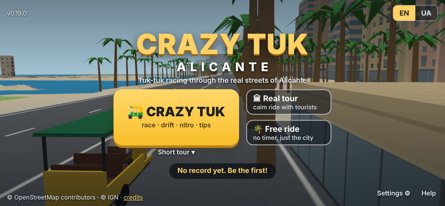
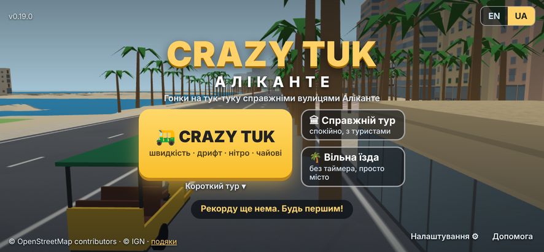
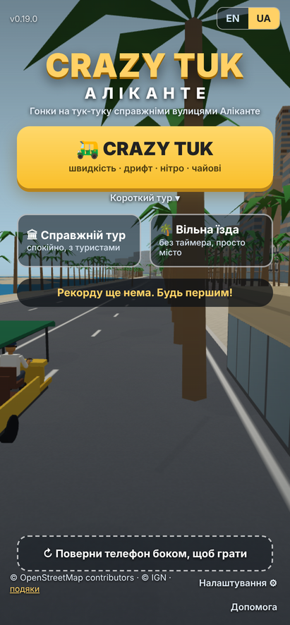
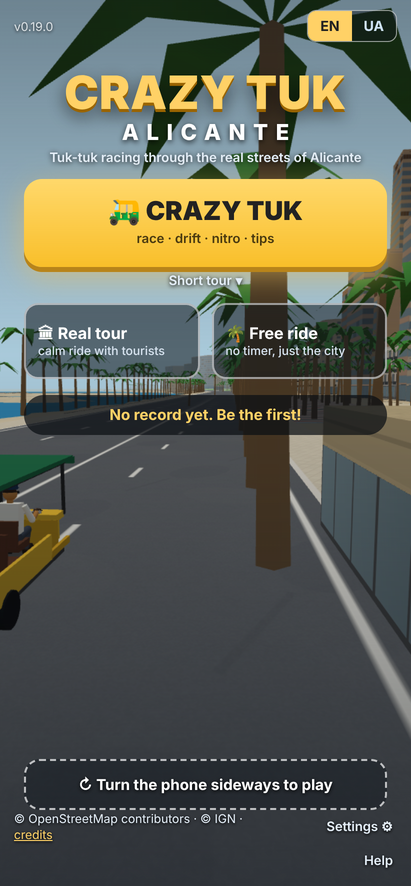

# Crazy Tuk 0.19.0: заставка, EN/UA, завантаження, водій, нітро 120

Дата: 2026-10-10. База: 0.18.3. План: `docs/plan-title-screen.md` (T1, T2, T3, T7, T9, T10, T11). Наступна версія 0.19.1: T4 (підказка першого запуску), T5 (меню паузи для гостей, «Додатково»), T6 (посилання й картка-прев'ю; картинку 1200×630 покажу перед публікацією).

## Коротко

- **Заставка** замість старої стартової картки, за макетами `docs/img/mock-title-landscape-en.png` і `mock-title-portrait-uk.png`: логотип «CRAZY TUK / ALICANTE» з гаслом, велика жовта кнопка «🛺 CRAZY TUK» зліва з дрібним рядком рівня «Short tour ▾» під нею (тап відкриває список), «Справжній тур» і «Вільна їзда» праворуч одна над одною, рекорд у темній «пігулці», EN | UA угорі, подяки одним рядком знизу зліва («credits» відкриває повний список), «Settings ⚙» і «Help» знизу справа. Та сама заставка на ПК (Enter = Crazy Tuk, Esc = на головну; кнопка Enter VR поруч із Settings). Вертикально: усе в стовпчик, велика кнопка на всю ширину, дві менші поруч, пігулка, унизу пунктирна картка «поверни телефон». Фон: статична картинка, поки місто вантажиться, далі живе 3D: тук-тук із водієм стоїть на Explanada, камера ззаду-справа дивиться вздовж пальмової алеї на море й повільно погойдується; тук-тук у лівій частині кадру, поза кнопками.
- **Екран завантаження**: та сама заставка зі смужкою прогресу, етапом у відсотках і підказками, що змінюються кожні 3.5 с (8 штук, EN/UA).
- **Дві мови інтерфейсу** (EN/UA): береться з телефона (`uk` у мовах → українська, інакше англійська), перемикач на заставці й у меню паузи, вибір запам'ятовується, `?lang=en|uk` для посилань. Перекладено все, що бачить гість: HUD, підсумки, меню, тур, картки пам'яток, назви рівнів, підказки, подяки. Редактор рівнів, «Звуки» і звіт діагностики лишаються українськими (це лише для тебе).
- **Водій за кермом**: гонщик у Crazy Tuk (шолом, зелена сорочка, жилет), таксист у Справжньому турі й на заставці (кашкет, біла сорочка, окуляри, вуса). Руки тримають кермо і повертають разом із ним, тіло нахиляється в поворотах і на газі, голова дивиться в занос; на точних воротах він піднімає кулак, на пропущених хитає головою, на ударі смикається, на зупинках туру показує рукою на пам'ятку. Туристи в Crazy Tuk сидять на другій лавці, щоб водія було видно з камери ззаду; після фінішу камера виїжджає збоку й показує водія з туристами.
- **Нітро до 120 км/год**, педаль (і автогаз) до 70: бак нітро переналаштовано, щоб забіг не «повз на 70» (цифри нижче).
- Регресія без змін: усі Node-перевірки й браузерні тести проходять; у VR водій прихований (у кабіні ти сам водій).

## 1. Заставка і завантаження (T2, T3)

Файли: `src/ui/titleScreen.js` (новий), `src/ui/help.js` (новий, таблиці допомоги EN/UA), `index.html` (стара картка видалена, лишився порожній `#overlay`), `assets/title-bg.jpg` (статичний фон, 44 КБ, кадр із самої гри), `main.js`.

- Завантаження: смужка 0 → 100 % за вагами етапів (текстури 2 %, `city.json` 5–17 % по байтах, рельєф 18 %, фото 24 %, моделі 30 %, будинки 36–86 %, шейдери 86–100 %). Будинки будуються синхронно одним шматком (так було й раніше), тому смужка на цьому етапі стоїть; план припускав прогрес по пачках, це я не підтвердив, тож чесно: там один стрибок. Коли все готове, смужка зеленіє на 0.3 с і з'являються кнопки; сірої «вимкненої» кнопки гість не бачить.
- Живий фон: поки заставка відкрита, тук-тук стоїть на Explanada (точка перших воріт, `TITLE_SPOT` у `main.js`), фоновий тур у стані «посадка» (туристи чекають біля готелю за 110 м, їх не видно); камера за 8 м позаду і 2.6 м правіше дивиться на 12 м уперед уздовж алеї, погойдується на ±1 м за 12 с. HUD, мінікарта й подяки під заставкою приховані. Вертикально теж рендериться (екран «поверни телефон» під заставкою не показується, `rotateGuard.quiet`).
- Esc на ПК і «На головну» в меню паузи повертають на заставку: забіг або тур скидається, тук-тук знову на Explanada; будь-яка кнопка гри стартує режим заново (тур: від готелю).
- Вибір маршруту Справжнього туру (короткий / замок / повний) переїхав у «Налаштування» на заставці (перший рядок); рівень Crazy Tuk — рядок під великою кнопкою і рядок у меню паузи телефона.
- `?autostart` і тести працюють як раніше (`#start` тепер кнопка Crazy Tuk, `#levelSel` / `#tourSel` є на заставці).

Скріни (емуляція S20 Ultra 886×411 і 411×886, програмний рендер) поруч із макетами:

| макет | гра 0.19.0 |
|---|---|
|  |  |
| (той самий макет, UA) |  |
|  |  |
| (той самий макет, EN) |  |

Відмінності від макета, які лишились: (1) під великою кнопкою є рядок рівня «Short tour ▾», якого на макеті нема (ти просив його залишити); (2) замість мінікарти зліва — живий тук-тук із водієм; (3) унизу справа крім «Settings ⚙» є «Help» (таблиці керування), бо старої стартової картки з таблицями більше нема; (4) у вертикальному положенні текст пігулки з рекордом переноситься на два рядки, як на макеті. ПК: `docs/img/title-en-pc.png` (кнопки на третину більші, Enter VR поруч із Settings), допомога: `docs/img/title-help-en.png`, меню паузи телефона: `docs/img/pause-menu-uk-phone.png`.

## 2. Мови EN / UA (T1)

Файли: `src/i18n.js` (модуль: `t('ключ', { n })`, `pick({ uk, en })`, `setLang`, подія `tuktuk-lang`), `src/i18n/en.js`, `src/i18n/uk.js` (257 ключів кожен), і всі файли інтерфейсу (`arcadeHud`, `phoneUi`, `hud`, `dashboard`, `fullMap`, `touchControls`, `tour`, `scoring`, `arcade`, `landmarks`, `models`, `diag/ui`, `main`).

- Дані: у `data/tour.json` додано `title_en` для 14 місць і `reviews_en` (12 відгуків); підказка в `_help`, як додати `intro_en` / `outro_en` / `fact_en`. Поки `fact` місця — «ЗАГЛУШКА», тур бере рядок з `arcade-facts.json` (uk або en), привітання й прощання — загальні фрази зі словника; слова PLACEHOLDER гість не побачить. Назви рівнів беруться з `title.en` рівня (є у всіх трьох), твої рівні з редактора — `uk`, поки не впишеш `en`.
- Перемикання без перезавантаження: екрани, що будуються один раз (меню паузи, кнопки дотику, HUD Crazy Tuk, карта), перебудовують підписи на події `tuktuk-lang`; тур, що стоїть на посадці, перезапускається з новою мовою; подяки на картках пам'яток перераховуються.
- Тест `node tools/test-i18n.mjs`: однакові ключі в обох словниках, без кирилиці в англійському, однакові `{підстановки}`, `title_en` у кожного місця, `reviews_en` дзеркалить `reviews`, факти uk/en для кожного місця.

Переклади назв місць (англійська): Hotel Meliá · Explanada and Casa Carbonell · Parque de Canalejas · Casa de las Brujas · The university building · Rambla de Méndez Núñez · Ayuntamiento (Town Hall) · Basílica de Santa María · Postiguet and Santa Bárbara Castle · Mercado Central · MARQ — Archaeological Museum · Santa Bárbara Castle — the gate · Plaza de los Luceros · Calle San Francisco — the mushroom street. Виправ у `tour.json`, якщо хочеш інакше.

## 3. Водій (T9, T10)

Файл `src/game/driver.js` (новий), `tourists.js` (посадка з другої лавки), `main.js`.

- Фігура з тих самих кубиків і циліндрів, що й туристи: один меш зі скелетом із 8 кісток, ~566 трикутників, один виклик малювання, кольори у вершинах. Два образи (`racer`, `taxi`), перемикаються за режимом.
- Руки: двокісткова зворотна кінематика до рукавиць на кермі; кермо вже повертається від керування (клавіатура, кнопки, VR), тож руки їдуть за ним. Коли у VR ти береш кермо руками, рукавиці водія ховаються (у кабіні водія немає взагалі: `setBodyVisible(false)` у VR і в режимі «кабіна»).
- Поведінка: нахил тулуба від бокового прискорення і газу, «притискання» на нітро, дихання; голова дивиться в бік заносу й зрідка озирається; події: `cheer()` (точні ворота), `nod()` (добре/є), `shake()` (пропущено, з'їзд з дороги), `hit(сила)` (удар), `point(бік, с)` (зупинка туру: рука на пам'ятку з того боку, де вона).
- Камера після фінішу: з правого боку, трохи спереду, дивиться на кабіну (водій і туристи в кадрі), плавно під'їжджає; те саме після висадки в турі.

## 4. Нітро 120 і бак (T7)

`src/vehicle/physics.js` (ARCADE): педаль/автогаз 70 км/год, нітро до 120, прискорення нітро 8.0 м/с², **витрата 0.2/с (повний бак = 5 с), пасивна зарядка 0.05/с (порожній → повний за 20 с), ворота доливають 0.35 / 0.20 / 0.10** (точно / добре / є). Було: витрата 0.25, зарядка 0.03, ворота 0.25 / 0.10 / 0.

Чому саме так (`node tools/sim-arcade.mjs`, короткий рівень / замок):

| водій | старий бак (0.25 / 0.03 / 0.25-0.10-0) | новий бак (0.2 / 0.05 / 0.35-0.20-0.10) |
|---|---|---|
| normal, short | бак порожній 8–10 с/забіг, середній заряд 44 % | 235 с, бак порожній ≈4 с, середній заряд 62 % |
| pro, short | — | 219 с |
| «нітро-любитель» (пряма ≥ 40 м → нітро), short | — | 213 с, нітро горить 18 % часу, вище 72 км/год 30 % часу |
| normal / pro, castle | — | 458 / 426 с; нітро-любитель 414 с, горить 13 %, бак порожній 4 с |

Висновок: той, хто тисне нітро на кожній прямій, майже ніколи не стоїть із порожнім баком (≈4 с за забіг), а швидкість обмежують повороти міста, не бак. Par-часи перераховано й вписано в рівні (`data/arcade-par.json`, `node tools/make-levels.mjs`): short 309 → 306, castle 540 → 595, full 456 → 443 с (замок став довшим, бо педаль 70 замість 150 на підйомі; раніше par міряв водій із нітро 150).

## 5. Перевірки

- Node: `sim-tour` (усі тури × обидва водії, числа ті самі), `sim-arcade short normal` (235 с, 6/6 точно), `test-collisions` (жоден кидок крізь стіну), `test-touch`, `test-camera`, `test-level-edit` (ALL OK), `test-sound-bank` (ALL OK), `check-comments` (чисто), новий `test-i18n` (ALL OK).
- Браузер (Chromium, програмний рендер 1–3 FPS, тому лише логіка й вигляд, не швидкодія), усе ALL OK: `t-title` (новий, 18 перевірок: EN/UA на ПК і телефоні, вибір мови з мови телефона, збереження, перемикання наживо, рядок рівня й кнопка VR, подяки, Допомога, Налаштування, Enter → Crazy Tuk, Esc → на головну, вертикальна заставка без блокувального екрана, старт із заставки на телефоні, підписи кнопок дотику, меню → «На головну»), `t-driver` (водій: образи, руки на кермі, кулак на точних воротах, камера збоку після фінішу, таксист показує рукою на зупинці, у кабіні прихований), `t-levels` (оновлений під заставку: вибір рівня на заставці, par 443, `?level=`, меню телефона, тур із заставки), `t-wave1` (меню телефона: автогаз / звук / музика збережені), `t-touch`, `t-desktop`, `t-vr` (IWER: сесія стартує із заставки, кадри йдуть), `t-editor` (редактор лишився українським і працює з новою заставкою), `t-soundlab`, `t-sound-game`. Старі тести, що шукали українські підписи, тепер відкривають гру з `?lang=uk` (без цього браузер тестів англомовний і гра правильно стартує англійською).
- FPS на S20 (T11) перевір сам: водій додає один виклик малювання і ~0.6 тис. трикутників (бюджет сцени ≈ 85 викликів), фон заставки — той самий рендер, що й гра, тож поки заставка відкрита, телефон гріється як у грі. Якщо це заважає, скажи: можу лишити лише статичну картинку.

## 6. Що лишилось і відкриті питання

- 0.19.1: T4 підказка першого запуску, T5 меню паузи для гостей («Додатково»), T6 посилання без `?v=`, OG-теги, картинка 1200×630 (покажу перед публікацією), назва в маніфесті.
- Тексти Справжнього туру англійською — поки з `arcade-facts.json`; коли напишеш свої `fact` / `intro` / `outro`, додай поруч `fact_en` / `intro_en` / `outro_en`.
- Звуки на паузі (`docs/sound-status.md`), без змін.
