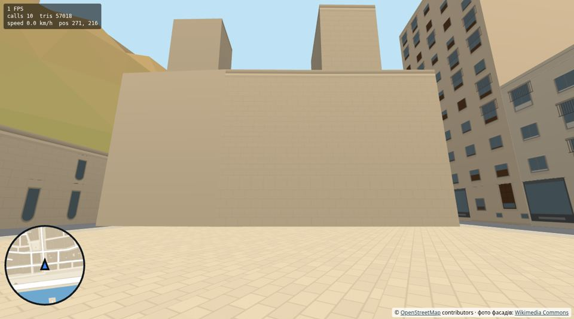
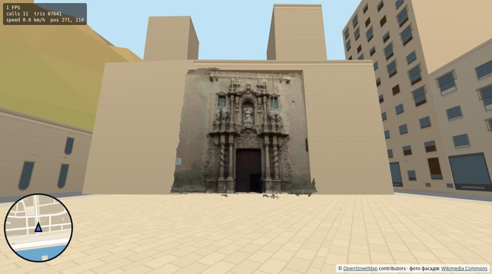

# Звіт L1: готовий 3D-скан у грі — портал базиліки Santa María

Дата: 2026-09-28
Версія: **0.9.0** (на панелі приладів `v0.9.0`)
Сайт: **https://archigreen55-prog.github.io/tuktuk-alicante-vr/?v=0.9.0**
Коміт: `fe2e32e` у `main`.

Крок L1 з [plan-realistic-landmarks.md](plan-realistic-landmarks.md): взяти готовий CC BY-скан, провести через конвеєр (зменшення, KTX2) і поставити на своє місце. Питання кроку — **чи варто сканувати ринок**. Коротка відповідь: так (п. 6).

| Було (0.8.0, `?model=0`) | Стало (0.9.0) |
|---|---|
|  |  |

Кадри з емулятора, з Plaça de Santa Maria. Ще: [зблизька](img/l1-near.jpg), [збоку — видно рельєф](img/l1-side.jpg).

---

## 1. Що зроблено

### 1.1 Портал Santa María у грі
- **Модель:** «Portada Basilica Santa Maria», автор **David González**, **CC BY 4.0**, Sketchfab. Ти завантажив її (GLB, 16.7 МБ).
  - Це скан простінка між вежами: бароковий портал (Juan Bautista Borja), стіна навколо, карниз.
  - Разом зі сканом ішов шматок площі 9 м завглибшки — прибрано.
- **Де:** головний фасад базиліки на Plaça de Santa Maria, стіна OSM №10 (way/22560738). Центр дверей — на 0.34 довжини цієї стіни. Місце оцінено за фронтальним фото з Wikimedia Commons: двері ≈ 15 м від південного кута фасаду.
- **Розмір:** 1 одиниця скану = 1 метр (перевірено за пропорціями: двері 2.6 × 4.1 м, простінок 14.3 × 14.7 м, карниз ≈ 12.6 м над порогом). Це оцінка, звір з натурою (п. 4).
- **Ніша в стіні.** Процедурна стіна за сканом вирізана і замінена нішею 1.2–1.4 м завглибшки. Двері, вікна й заглиблення порталу видно, а не впираються в пласку стіну. Ніша трохи менша за скан, тому рвані краї скану лежать на стіні.
- **Вежі базиліки.** В OSM вони — окремі будинки (22 і 24 м), і гра малювала їх як житлові: рожеві стіни з вікнами. Ніша відкрила стіну однієї з них. Тепер ніша вирізається в усіх стінах у площині моделі, а вежі отримали кам'яний стиль `civic` у `data/facades.json`.
- **Зіткнення:** цоколі колон, що виступають зі стіни (нижче 2.5 м), — перешкода для тук-тука, як будинок.
- **Автор у картці факту** на зупинці «Basílica de Santa María»: «3D-скан: David González (CC BY 4.0) · Sketchfab». Внизу сторінки — посилання «3D-скани: Sketchfab» на [assets/models/CREDITS.md](../assets/models/CREDITS.md). Там автор, ліцензія, посилання на оригінал і що змінено. Політика там же: лише CC BY / CC BY-SA / CC0 і твої скани, без NC і ND.

### 1.2 Конвеєр для сканів: `tools/prepare-model.mjs`
Той самий шлях підійде для твого скану ринку з RealityScan або KIRI:

```
npm install                                    # один раз (gltf-transform, meshoptimizer, sharp)
node tools/prepare-model.mjs santa-maria-portal
node tools/prepare-model.mjs --inspect santa-maria-portal   # розміри й осі джерела
```

Що робить:
1. Зводить сцену в один меш — **1 draw call**.
2. Повертає (`rotate`), щоб +Y дивилось угору, а +Z — назовні зі стіни.
3. Знаходить площину стіни — глибину, де лежить найбільше фронтальних граней.
4. **Прибирає скановану землю** (горизонтальні й похилі шматки перед стіною, уламки менше 300 трикутників) і ставить поріг на висоту 0.
5. Масштабує: `scale` (типово 1) або `width` у метрах.
6. Спрощує до `triangles` (meshoptimizer).
7. Текстури: ≤ `texture` px, **KTX2** (Basis Universal, ETC1S або `"ktx": "uastc"`).
8. Геометрія стискається meshopt.

Утиліту `ktx` (KTX-Software 4.4.2) скрипт сам завантажує з офіційного релізу Khronos у `tools/.bin/` і перевіряє контрольну суму. sudo не потрібен.

### 1.3 У грі: `src/city/models.js`
- GLTFLoader + **KTX2Loader** (транскодер Basis з того самого CDN three.js) + MeshoptDecoder.
- Матеріал — Lambert, як у всього міста, двобічний, як у джерела.
- Модель ставиться на стіну OSM за полями `edge` / `at` / `offset` / `niche` у `data/facades.json` → `models` (формат — на початку `models.js`).
- **`?model=0`** — без моделей, для порівняння FPS.
- Модель вантажиться на екрані завантаження. Рядок стану показує «… · 1 3D-модель за X мс».

### 1.4 Попутно
- Громадські будівлі (`civic`: церкви, ринок, ратуша) на стінах без вулиці — на пішохідні площі, у двори — тепер мають кам'яну стіну без «дворових» вікон. Раніше головний фасад Santa María на площі мав ряди квартирних вікон.
- Фото фасадів і їхні маски тепер вантажаться паралельно, а не одне за одним — це було в «дрібницях на наступну викладку» з [report-mercado.md](report-mercado.md).

---

## 2. Цифри

| | Джерело (Sketchfab) | У грі |
|---|---|---|
| Трикутники | 65 292 (з них ~34 тис. — площа) | **30 585** |
| Текстура | 4096² PNG, 14.4 МБ файл, ≈ 89 МБ у відеопам'яті | **2048² KTX2 ETC1S**, 653 КБ файл, ≈ 2.8 МБ у відеопам'яті (на Quest транскодується в ETC2) |
| Файл | 16.7 МБ | **1.36 МБ** GLB |
| Роздільність текстури на стіні | — | ≈ 140 px/м (у 3 рази різкіше за фото ринку, 49 px/м) |

Заміри в емуляторі (Chrome + IWER) і на ноутбуці (Intel HD 4600, справжній GPU):

| | 0.8.0 / `?model=0` | 0.9.0 |
|---|---|---|
| Draw calls, стіл, портал у кадрі | 10 | **11** (+1) |
| Трикутники, стіл | 57 018 | **87 641** (+30.6 тис.) |
| Draw calls, VR (обидва ока), кабіна на площі перед порталом | 36 | **38** (+1 на око) |
| Трикутники, VR (обидва ока) | 117 388 | **178 634** (+61 тис.) |
| Завантаження моделі (з локального сервера) | — | 320–460 мс |
| GPU, ноутбук, портал на весь екран (з 8 м) | — | ≈ **+0.4 мс** на рендер сцени (~5 %) |
| GPU, ноутбук, з 20 м | — | різниці не видно (у межах шуму) |

**Про FPS чесно:**
- Емулятор малює програмно (~1 FPS) і FPS не показує.
- На ноутбуці я вмикав і вимикав модель по черзі, 10 разів; шум між замірами того самого порядку, що й ефект.
- Твій запас GPU на Quest ≈ 6–8×. 30 тис. трикутників і одна стиснена текстура — дрібниця для цього запасу, але перевірити можна лише в шоломі (п. 4).

---

## 3. Як перевіряли

| Перевірка | Результат |
|---|---|
| Конвеєр на зразковій моделі Khronos і на порталі | KTX2 + meshopt, завантаження в грі без помилок |
| Портал з площі: здалеку, зблизька, знизу, збоку, згори | рельєф видно, права частина не ховається за вежею, уламків площі майже немає |
| Ніша без моделі (`group.visible = false`) | задні стінки на місці; знайшли й виправили вежу-«будинок» за сканом |
| `?model=0` | базиліка як раніше, помилок немає |
| Вхід у VR (IWER), тук-тук на площі перед порталом | 38 calls, шейдери компілюються, помилок немає |
| `build-city.mjs` | змінився лише стиль двох веж, решта city.json та сама |
| Живий сайт 0.9.0 | див. п. 7 |

---

## 4. Що перевірити в шоломі
1. **FPS на Plaça de Santa Maria** з `?fps`: під'їхати до порталу, покрутити головою. Для порівняння — те саме з `&model=0`.
2. **Рельєф зблизька:** колони, скульптури в нішах, глибина дверей. Коли рухаєш головою, має бути видно паралакс — це головна перевага скану над фото.
3. **Краї скану:** рвана межа скану й процедурна стіна поруч — наскільки кидається в очі.
4. **Розмір і місце** (ти знаєш портал у натурі):
   - чи двері не завеликі або замалі відносно тук-тука й людей;
   - чи портал по центру між вежами.
   - Якщо ні, у `data/facades.json` → `models`:
     - `at` (частка стіни 10, зараз 0.34) — досить оновити сторінку;
     - `scale` (наприклад 1.1) — потім `node tools/prepare-model.mjs santa-maria-portal`.
5. **Світло:** освітлення запечене в скан, а гра додає своє сонце. Чи не надто темно внизу порталу.
6. **Картка факту** на зупинці: рядок «3D-скан: David González (CC BY 4.0) · Sketchfab».
7. **Час завантаження** на стартовому екрані: «… · 1 3D-модель за X мс».

---

## 5. Що не вийшло або обмеження
1. **Зупинка туру «Basílica de Santa María» стоїть на Carrer de Jorge Juan, з південного сходу.** Звідти портал не видно: він дивиться на пішохідну Plaça de Santa Maria на захід. Щоб побачити його в турі, треба під'їхати до площі. Де ви зупиняєтесь з туристами насправді? Якщо на площі чи на Carrer de la Vila Vella — поміняю `road` у `data/tour.json` (сам не чіпав, це твій файл).
2. **Розмір і місце — оцінка** (одиниці скану = метри; позиція з фото ±0.5 м).
3. **Подвійне світло.** Скан знятий з запеченим освітленням (матеріал «unlit»), а гра освітлює його ще раз. Унизу трохи темніше, ніж насправді.
4. **Межа скану** рвана. Навколо — пласка процедурна стіна іншого тону й фактури. Біля землі лишилось кілька дрібних уламків площі.
5. **Вежі й решта фасаду — процедурні** (кам'яні блоки, без справжніх вікон і годинника). Це вирішать твої фото фасаду або скан ширшої частини.
6. **Транскодер Basis** (≈ 0.6 МБ) вантажиться з CDN jsdelivr, як і сам three.js. Без інтернету модель не завантажиться, гра працює без неї.
7. **FPS у шоломі** не міряний.

---

## 6. Висновок: чи сканувати ринок
**Так.** Навіть чужий скан 2019 року дає у VR те, чого фото-фасад не дає:
- справжні колони, ніші й глибину дверей;
- правильний вигляд збоку.

Ціна — +1 draw call і ~30 тис. трикутників на пам'ятку, текстура ≈ 3 МБ і файл ≈ 1.4 МБ. Бюджет дозволяє 3–5 таких пам'яток у кадрі.

Для ринку з твого **Samsung S20 Ultra:**
- **RealityScan Mobile** (Android) має підійти. Якщо не встановиться з Google Play — **KIRI Engine**.
- Знімай у звичайному режимі 12 Мп, не 108 Мп: застосунок однаково бере кадри сам, а великі файли лише повільніші.
- Як знімати — [plan-realistic-landmarks.md](plan-realistic-landmarks.md) §2.3:
  - неділя зранку, хмарно або тінь;
  - 150–300 кадрів, перекриття 70–80 %;
  - три висоти, обхід ротонди по дузі.

Потім GLB — у `assets/models/src/`, запис у `data/facades.json` і `node tools/prepare-model.mjs`. Для ринку скан замінить фото-фасади частинами: спочатку головний фасад із пілонами.

---

## 7. Живий сайт
GitHub Pages віддає 0.9.0 через ~30 с після push. Перевірено в емуляторі на живій адресі:
- версія на панелі й на стартовому екрані `0.9.0`;
- модулі, `city.json`, фото й модель завантажені з `?v=0.9.0`, жодного запиту без версії;
- транскодер Basis підтягнувся з jsdelivr;
- рядок стану: «… · 4 фото фасадів за 418 мс · 1 3D-модель за 629 мс»;
- стіл біля порталу: 11 calls / 87.6 тис. трикутників;
- вхід у VR, тук-тук на площі перед порталом: 36 calls / 178.6 тис. трикутників (обидва ока), портал у кадрі, помилок немає;
- рядок у картці місця «Basílica de Santa María»: «3D-скан: David González (CC BY 4.0) · Sketchfab».

Разом з цим push на GitHub пішов і коміт іншого агента `753bb8d` («TukTuk OS sync step 1»). Він уже лежав у локальному `main`, я його не змінював. `docs/plan-terrain.md` (теж іншого агента) не комітив.

---

## 8. Файли
- `src/city/models.js` — завантаження GLB/KTX2, розміщення на стіні OSM, ніші, зіткнення, рядок автора.
- `src/city/buildCity.js` — стіна з нішею (`addNicheWall`).
- `src/city/facades.js` — кам'яні стіни `civic` без вулиці.
- `src/city/landmarks.js` — паралельне завантаження фото й масок.
- `src/main.js` — `?model=0`, завантаження моделей, автор у картці.
- `tools/prepare-model.mjs` — конвеєр сканів.
- `package.json` — gltf-transform, meshoptimizer (лише для скрипта).
- `.gitignore` — `tools/.bin/`, `assets/models/src/`.
- `data/facades.json` — запис порталу, вежі `civic`.
- `data/city.json` — стиль веж.
- `assets/models/` — `santa-maria-portal.glb`, `CREDITS.md`.
- `index.html` — посилання на авторів сканів, версія.
- README — розділ «3D models of landmarks».
- `docs/img/l1-*.jpg` — кадри для цього звіту.
