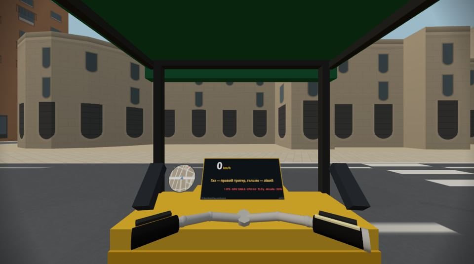
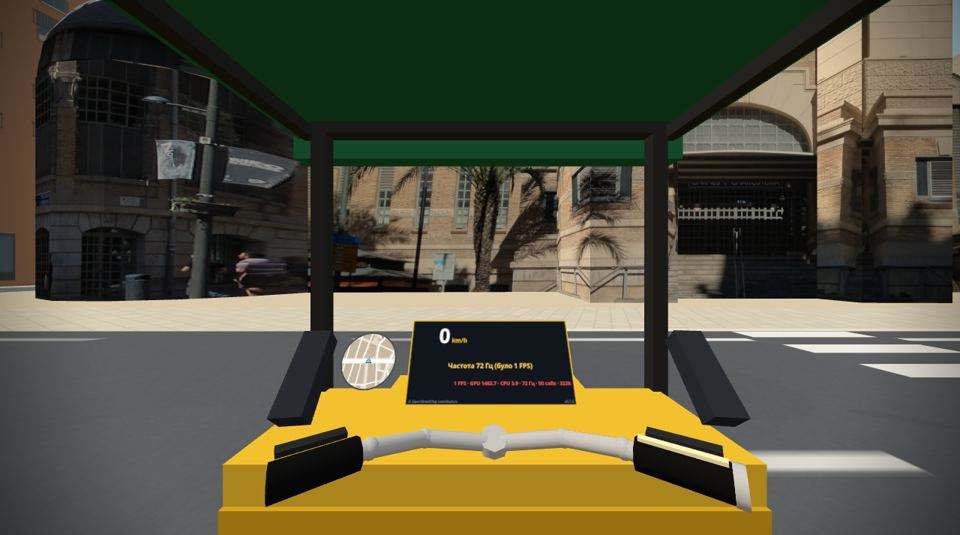

# Звіт: реалістичний Mercado Central (фото-фасади)

Дата: 2026-09-28
Версія: **0.8.0** (на панелі приладів `v0.8.0`)
Сайт: **https://archigreen55-prog.github.io/tuktuk-alicante-vr/?v=0.8.0**
Коміт: `COMMIT` у `main`.

Частина 1 зроблена за архітектурою з [plan-stage-5.md](plan-stage-5.md) §2.7. Частина 2 — лише план: [plan-realistic-landmarks.md](plan-realistic-landmarks.md) (3D-скан, колекція Fovea на Sketchfab, порівняння способів).

| Було (0.7.0, `?photo=0`) | Стало (0.8.0) |
|---|---|
|  |  |

Кадри з емулятора Quest 3 (кабіна тук-тука на зупинці туру біля ринку). Ще: [вид з протилежного тротуару](img/mercado-street.jpg), [ротонда з куполом](img/mercado-dome.jpg), [задній фасад](img/mercado-back.jpg).

---

## 1. Що зроблено

### 1.1 Ринок з фото
Mercado Central (OSM way/21410214) тепер складений з чотирьох вільних фото з Wikimedia Commons:

| Частина | Фото | Автор, ліцензія | Розмір у грі |
|---|---|---|---|
| Головний фасад на Avinguda Alfons el Savi: пілони «MERCADO / DE ABASTOS», центральна вежа з кулями, арка, сходи, ступінчасті крила | 2026 р., фронтальне, сонце | Varondán, CC BY-SA 4.0 | 2048×1216 px = 42 × 24.9 м, 49 px/м |
| Ротонда на розі з Carrer del Capità Segarra: барабан + **3D-купол із ліхтарем** | 2016 р. | Kolforn, CC BY 3.0 | 749×1024 px = 15.1 × 20.7 м, 50 px/м |
| Задній фасад на Plaça del 25 de Maig: фронтон з овальним вікном, три арки, «MERCADO CENTRAL» | 2009 р. | Joanbanjo, CC BY-SA 3.0 | 817×1024 px = 15.2 × 19.1 м, 54 px/м |
| Довгі бічні стіни (Calderón de la Barca, Capità Segarra) і крила заднього фасаду: один проліт стіни (цоколь, жалюзі, скління, край даху) повторюється | 2009 р. | Etnacila, public domain | 124×333 px = 4.2 × 11.3 м, 30 px/м |

- **Силует.** Над дахом стирчать вежі, кулі, ступінчастий фронтон — усе з фото; небо вирізане маскою. Край маски згладжений (alpha to coverage при MSAA 4x). Кольори під маскою заповнено кольорами будинку, щоб на mip-рівнях край не синів.
- **Купол** — тіло обертання за профілем, знятим із силуету на фото (барабан 10.2 м, купол до 17.1 м, ліхтар до 19 м, верх 20.6 м), 32 сегменти, текстура з того самого фото. Праву половину купола на фото закриває пальма, тому купол бере ліву половину дзеркально.
- **Виступи.** У контурі OSM центральний блок виступає на 4.7 м, середина запала на 1.4 м. Бічні стінки виступів беруть фото сусідньої грані «за ріг»: карнизи й цегла тягнуться на бік, без смуг.
- **Точність прив'язки.** Контур OSM і фото розходяться до 1.3 м (лівий пілон). Поле `align` у `data/facades.json` каже, де кут стіни насправді на фото, і текстура пілонів лягає точно на виступи.
- **Висота.** Висоту обчислює скрипт із перспективи. Рівень землі (його на фото закривають сходи й кіоски) звірено з другим фото, знятим з рівня вулиці. Дах лишився пласким, на 10 м (рівень карниза ротонди).

### 1.2 Як це влаштовано (+1 draw call)
- Стіни, які покриває фото, **не будуються в процедурних чанках**, а йдуть в **один окремий меш** зі своїми UV (`src/city/landmarks.js`). Решта міста без змін.
- Усі фото всіх майбутніх фото-будинків пакуються під час завантаження в **один атлас** 2064×2272 (зараз 4 фото, по 8 px рамки проти кровотечі на mip-рівнях). Тому будь-яка кількість пам'яток — **+1 draw call** разом.
- Матеріал — той самий `MeshLambertMaterial` (світло й туман як у міста), колір з атласу. Плитка стіни повторюється по горизонталі без шва на mip-рівнях (`textureGrad`).
- Двобічний: вежі над дахом видно й ззаду (трохи темніші).
- **`?photo=0`** — ринок без фото, як у 0.7.0, для A/B-порівняння FPS.
- Фото вантажаться з `?v=<версія>`, `data/facades.json` — завжди свіжий (як `tour.json`). Якщо фото не завантажилось, будинок лишається процедурним, гра не падає.

### 1.3 Автори й ліцензії
- **У картці факту** на зупинці «Mercado Central» (на панелі у VR і в картці на екрані ноутбука) є рядок: «Фото фасаду: Varondán (CC BY-SA 4.0), Kolforn (CC BY 3.0), Joanbanjo (CC BY-SA 3.0), Etnacila (public domain) · Wikimedia Commons». Рядок збирається автоматично з полів `credit` у `data/facades.json` для будинку цього місця.
- **[assets/facades/CREDITS.md](../assets/facades/CREDITS.md)** — таблиця: файл, автор, ліцензія, посилання на оригінал, що змінено. Там же пояснено, що змінені фото CC BY-SA поширюються на тих самих умовах.
- Внизу сторінки на ноутбуці поруч з OpenStreetMap додано посилання «фото фасадів: Wikimedia Commons» на CREDITS.md. README оновлено.
- Фото без вільної ліцензії не брав. З ~20 фото фасадів у категорії Commons вибрав найфронтальніші.

### 1.4 Скрипт `tools/prepare-facade.mjs` — для твоїх фото
Бере фото, виправляє перспективу за 4 кутами з `data/facades.json`, обрізає, зменшує до ≤ 2048 px, стискає в JPEG і робить маску неба.

```
npm install                                        # один раз: бібліотека sharp для обробки фото
node tools/prepare-facade.mjs                       # усі фото
node tools/prepare-facade.mjs mercado-front         # одне фото
node tools/prepare-facade.mjs --list way/21410214   # стіни будинку: номери для "edges"
node tools/prepare-facade.mjs --check mercado-front # малює кути й контур на оригіналі
                                                    # і стіни OSM на результаті → assets/facades/.check/
```

**Як підставити своє фото замість фото з вікісховища:**
1. **Зніми фасад:** з протилежного тротуару, увесь фасад у кадрі, камера рівно (без сильного нахилу вгору). Найкраще — хмарний день або тінь (без різких тіней), без людей і машин перед фасадом. Можна кілька кадрів.
2. **Поклади фото** в `assets/facades/`, наприклад `assets/facades/moe-mercado.jpg`.
3. **Знайди 4 кути** у пікселях. Відкрий фото в GIMP (координати курсора внизу вікна) або в будь-якому переглядачі, який їх показує. Порядок: верх-ліво, верх-право, низ-право, низ-ліво.
   - Ліво й право — кінці фасаду.
   - Низ — земля біля стіни.
   - Верх — будь-яка горизонтальна лінія точно над ними (карниз, пояс).
4. **Онови запис** у `data/facades.json`:
   - `"from": "assets/facades/moe-mercado.jpg"`;
   - `"corners": [[x, y], [x, y], [x, y], [x, y]]`;
   - за бажанням `"outline"` — точки силуету проти неба (вежі, кулі);
   - `"credit"` прибери, якщо фото твоє.
5. `node tools/prepare-facade.mjs mercado-front`, потім `--check mercado-front`. На `assets/facades/.check/mercado-front-walls.jpg` червоні лінії мають стояти на кутах виступів. Якщо ні — поправ числа в `"align"`.
6. Онови сторінку. Локально `python3 -m http.server`, потім Ctrl+Shift+R, бо браузер тримає старе фото в кеші до нової версії.

Висоту фасаду скрипт рахує з перспективи. Для телефона без EXIF він бере об'єктив 26 мм. Якщо знаєш висоту карниза (поверхи, рулетка), впиши `"height"` у метрах — точніше.

Формат `data/facades.json` описано на початку `src/city/photoFacades.js`. Поля:
- `edges` — які стіни;
- `span` — частина фасаду;
- `view` — звідки знімали (для круглих стін);
- `lathe` — профіль купола;
- `mirror`, `align`;
- `wall` — плитка, що повторюється.

---

## 2. Цифри

Заміри в емуляторі (Chrome + IWER, SwiftShader) і на ноутбуці (Intel HD 4600, справжній GPU, таймер GPU).

| | 0.7.0 / `?photo=0` | 0.8.0 | Бюджет |
|---|---|---|---|
| Draw calls, стіл, ринок у кадрі | 16 | **17** (+1) | ≤ 60 |
| Draw calls, VR (обидва ока), кабіна на зупинці біля ринку | 48 | **50** (+1 на око) | — |
| Трикутники, стіл | 158 660 | **159 440** (+780: +852 фото-меш, −72 процедурні стіни) | ≤ 250k |
| Трикутники, VR (обидва ока), зупинка | 320 672 | **322 232** | — |
| Текстура-атлас | — | 2064×2272 RGBA ≈ 18 МБ, з mip ≈ **24 МБ** пам'яті GPU | див. п. 5 |
| Завантаження файлів | — | **+668 КБ** (4 JPEG + 3 маски PNG) | — |
| Час на екрані завантаження (декодування + атлас) | — | ≈ **340 мс** в емуляторі (CPU) | ≤ 5 с разом |
| Фото на фасад | — | максимум 2048 px (головний фасад рівно 2048) | ≤ 2048 px |
| GPU-час фото-мешу, ноутбук HD 4600, 1280×713, MSAA 4x | — | ≤ **0.3 мс** на рендер сцени (~3–4 %), коли ринок займає чверть-половину екрана; поза ринком 0 (меш відсікається) | — |

**Про FPS чесно.**
- Емулятор малює програмно (~1 FPS), тож FPS у шоломі він не покаже.
- На ноутбуці я вмикав і вимикав фото-меш по черзі, 10 разів у кожному ракурсі. Різниця 1–1.4 мс на 4 рендери сцени, а шум між замірами того самого порядку. Тобто фото-фасад коштує кілька відсотків GPU там, де ринок великий на екрані, і нічого деінде.
- Твій запас GPU на Quest ≈ 6–8× (заміри 0.5.0), тому падіння нижче 90 FPS я не чекаю. Це треба перевірити в шоломі (п. 4).

---

## 3. Як перевіряли
| Перевірка | Результат |
|---|---|
| `prepare-facade.mjs` на 4 фото: гомографія, висота з перспективи, маска, `--list`, `--check` | працює, 1–6 с на фото |
| Стіл: 7 ракурсів (з тротуару навпроти, з зупинки, ротонда, задній фасад, боки, з повітря) | фото на місці, пілони на виступах, купол без дір, плитка боків без повторюваних предметів |
| `?photo=0` | ринок процедурний, як у 0.7.0, помилок немає |
| Вхід у VR (IWER), кабіна на зупинці біля ринку | 50 calls, шейдер компілюється, помилок немає |
| Картка на зупинці | рядок авторів у 2 рядки на панелі й у картці на екрані |
| `build-city.mjs` (нове поле `h`) | city.json не змінився (h = 10 збігся) |
| `sim-tour.mjs short careful` | 5 зірок, як раніше |
| Живий сайт 0.8.0 | див. п. 6 |

---

## 4. Що перевірити в шоломі
1. **FPS біля ринку** з `?fps`. Точки: зупинка «Mercado Central» у турі, середина Avinguda Alfons el Savi навпроти фасаду, поворот голови від ринку й назад. Для порівняння — ті самі точки з `&photo=0`.
2. **Вигляд з кабіни:** чи читається ринок як справжній. Чи не заважають «намальовані» пальми, кіоски, сходи на фасаді. Чи не надто розмитий фасад зблизька (49 px/м).
3. **Край силуету** веж і куль проти неба: чи немає «сходинок» і мерехтіння, коли їдеш.
4. **Купол і ротонда:** форма, чи не видно шва по краю барабана.
5. **Бокові стіни** (проїхати Calderón de la Barca): чи не набридає повтор прольоту.
6. **Картка факту:** чи читається рядок авторів на панелі.
7. **Час завантаження** на стартовому екрані: «… · 4 фото фасадів за X мс».

---

## 5. Що не вийшло або обмеження
1. **Фото з різних років і погоди** (2009, 2016, 2026): різні кольори й освітлення. Ротонда знята в тіні, тому темніша за головний фасад. Твої фото, зняті в один день, це приберуть.
2. **У текстурі «запечено» все, що стояло перед фасадом:**
   - головний фасад: пальми, кіоски, сходи, пішохід;
   - задній: ліхтарі, прапорці, риштування;
   - ротонда: ліхтар із банерами.

   Зблизька видно, що це плоский малюнок. Рельєфу (глибини вікон, карнизів) немає — це межа фото-текстури. 3D-скан це вирішує (див. план).
3. **Дах плаский, на 10 м.** Справжній ринок має двоскатний дах з рядом вікон нагорі. На бічній плитці край даху й ці вікна намальовані на стіні: з вулиці схоже, з повітря — ні.
4. **Бічна плитка низької роздільності** (30 px/м). Її вирізано з косого фото 2009 року. Зблизька вона розмита.
5. **Ширину нави на задньому фасаді (15.2 м) оцінено за зростом людей на фото.** Крила заднього фасаду покриває та сама бічна плитка, хоча насправді там цегла з віконницями.
6. **Висоти** обчислено з перспективи й звірено з другим фото, похибка ~0.5 м. Якщо знаєш справжню висоту карниза або веж — впиши `height`.
7. **Пам'ять.** Один ринок — ≈ 24 МБ пам'яті GPU (атлас без стиснення). Для 10 пам'яток треба стиснені текстури KTX2 (у 4–6 разів менше), див. план.
8. **Реальний FPS** — тільки в шоломі. На ноутбуці вплив на межі шуму вимірювань.

---

## 6. Живий сайт
LIVE

---

## 7. Файли
- `src/city/photoFacades.js` — спільна математика: стіни, проєкція, `align`, коло для купола, опис формату.
- `src/city/landmarks.js` — завантаження фото, атлас, меш, купол, матеріал, рядок авторів.
- `src/city/buildCity.js` — стіни з фото пропускаються в чанках, +1 меш.
- `src/main.js` — `?photo=0`, завантаження `data/facades.json`, автори в місцях туру.
- `src/game/tour.js`, `src/ui/dashboard.js`, `src/ui/hud.js` — рядок авторів у картці.
- `tools/prepare-facade.mjs` — підготовка фото.
- `tools/build-city.mjs` — поле `h`.
- `package.json` — лише для скрипта (`sharp`); гра, як і раніше, без збірки.
- `data/facades.json` — ринок: 4 фото, `h`, `align`, профіль купола.
- `assets/facades/` — 4 JPEG + 3 маски, `CREDITS.md`.
- `docs/img/` — кадри для цього звіту.
