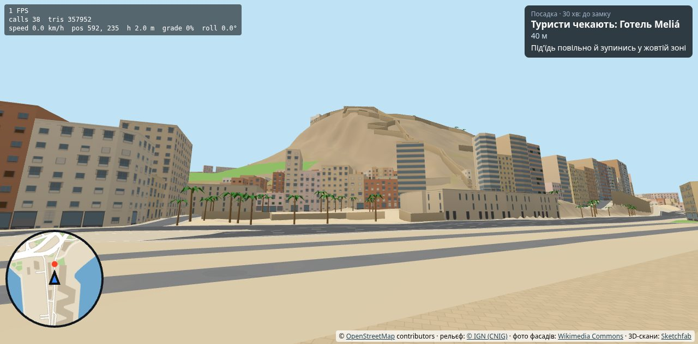
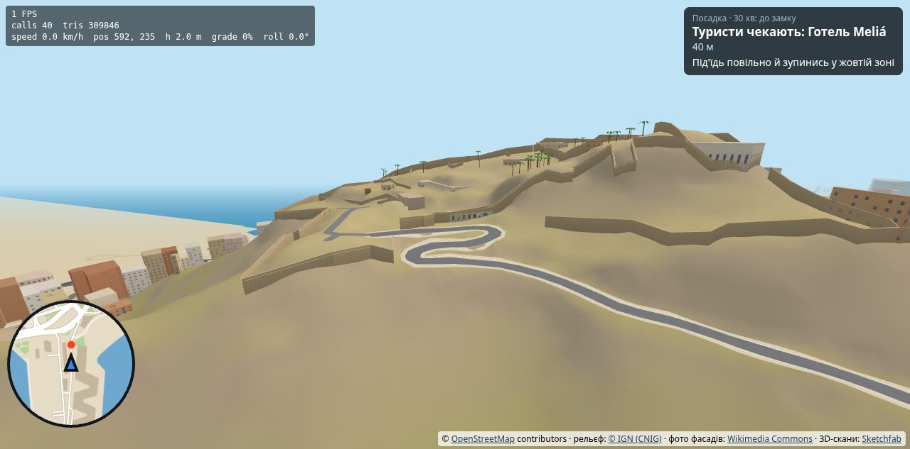

# Звіт: рельєф, гора Benacantil і дорога до замку (T0 + T1)

Дата: 2026-09-30
Версія: **0.10.0** (на панелі приладів `v0.10.0`)
Сайт: **https://archigreen55-prog.github.io/tuktuk-alicante-vr/?v=0.10.0**
Коміт: `edaa2b4` у `main`.

Зроблено за [plan-terrain.md](plan-terrain.md), етапи T0, T1a, T1b, T1c. Мета цієї викладки — перший тест рельєфу в шоломі: підйом до воріт замку, нахил кабіни, спуск.

| З пляжу Postiguet | Дорога до замку |
|---|---|
|  |  |

Ще кадри (стіл, емулятор): [гора й місто з повітря](img/terrain-hill-air.jpg), [ворота й майданчик](img/terrain-gate-air.jpg), [з кабіни на підйомі](img/terrain-cockpit-climb.jpg), [погляд назад на місто з 112 м](img/terrain-cockpit-climb-back.jpg), [біля воріт](img/terrain-cockpit-gate.jpg), [старе місто на схилі](img/terrain-oldtown.jpg), [з-за тук-тука](img/terrain-chase-climb.jpg), [VR-емулятор на підйомі](img/terrain-vr-road.jpg).

---

## 1. Як це виглядає і що перевірити в шоломі

1. На стартовому екрані є новий тур **«30 хв: до замку»**: Meliá → Explanada → Santa María → Postiguet → MARQ (на ходу) → **ворота замку** → Meliá. Точки й тексти — заглушки в `data/tour.json`, як завжди.
2. Від MARQ дорога йде вгору **931 м, з 41 до 117 м** над морем. Ухили 8–14 %, без шпильок. Тук-тук на повному газу піднімається на **~20 км/год** (потужність двигуна тепер обмежена, як у справжнього електричного).
3. Зупинка «ворота замку» стоїть на кінці асфальтованої дороги біля майданчика (38.34972, −0.47778), перед входом у двір. Мури замку — з OSM, у них є проїзд там, де проходить дорога.
4. **Нахил кабіни.** Кабіна нахиляється разом з дорогою: тангаж до 12°, крен обмежений 5°, обидва згладжені. На стартовому екрані й клавішею **K** — три варіанти: **повний / половина / вимкнено**. Це головне, що треба відчути в шоломі: який варіант не дає нудоти на підйомі та на спуску.
5. **Спуск.** Без газу тук-тук гальмує двигуном (1 м/с²), а обмежувач не дає розігнатись швидше 30 км/год на 4 %, 25 на 8 %, 20 на 12 %. Гальмо на спуску потрібне лише в поворотах. Подія «Надто швидко на спуску!» (−5) вмикається, коли швидкість вища за обмежувач більш ніж на 5 км/год.
6. На місці тук-тук стоїть на будь-якому схилі (стоянкове гальмо), не скочується. Задній хід — як був.
7. Крутий схил (> 33 % за 1.5 м попереду) працює як стіна: з'їхати з дороги на скелю чи в укіс не вийде; віньєтка й вібрація — як від дотику до стіни, але настрій туристів це не псує.
8. Усе старе місто на схилі гори тепер є: 406 будинків і 41 вулиця, які раніше вилучав ручний контур гори, повернулись. Mercado стоїть на 15 м, Luceros на 21 м — Rambla тепер піднімається до Luceros.
9. `?terrain=0` — та сама версія з пласким містом, для порівняння FPS і відчуттів.

Що саме перевірити:
- **FPS** (`?fps` або X) у трьох точках: старт біля Meliá, середина підйому, **біля воріт із поглядом на місто** — найважчий кадр, видно всю зону.
- **Нудота** на підйомі, на спуску, у поворотах серпантину — при трьох варіантах нахилу.
- Чи не «стрибає» кабіна на перегинах (сітка 5 м; профіль дороги згладжений вікном 30 м).
- Чи проїжджаються вузькі вулиці старого міста на схилі (Santa Cruz): стіни, уступи, сходи-вулиці.
- Зупинка біля воріт: чи зручний майданчик для розвороту, чи це те місце, де ти розвертаєшся насправді.

---

## 2. Що зроблено

### 2.1 Дані (T0)
- `tools/area.mjs` — одна зона для всіх інструментів: північ до **38.3550** (MARQ і початок підйому), схід до **−0.4735** (площа Gómez Ulla), захід і південь як були. **Початок координат не рухався**, тож усі ручні координати в коді й даних лишились чинними. Зона 1.97 × 1.67 км.
- `tools/fetch-dem.mjs` — модель рельєфу **IGN MDT05, 5 м** через WCS `servicios.idee.es` одним запитом (0.7 с) → `data/raw/dem5.asc` (1.2 МБ, у git). Ліцензія CC BY 4.0, атрибуція на стартовому екрані, на панелі, у README і `data/LICENSE`.
- `tools/fetch-osm.mjs` — та сама зона плюс мури (`barrier=*`), форти, паркінги, укоси. Нові сирі дані: 4254 будинки, 928 вулиць.
- `src/city/terrain.js` — сітка висот для Node і браузера: білінійна висота, градієнт, читання ASCII-сітки, `terrain.bin` (Int16 у сантиметрах, 346 КБ).

### 2.2 Рельєф у даних (T1a, `tools/build-city.mjs` + `tools/terrain-ops.mjs`)
- **Профіль кожної вулиці**: висота з сітки кожні 5 м, згладжування вікном ±15 м, обмеження ухилу 25 %.
- **Перехрестя**: на спільному вузлі OSM усі вулиці отримують одну висоту — висоту найважливішої (проспект > вулиця > пішохідна). Пішохідні підлаштовуються під проїзні.
- **Врізання** в сітку: клітинки в межах проїжджої частини + тротуар + 1 м беруть висоту профілю (поперек рівно), далі 4 м переходу. Вулиця не перезаписує клітинки сусідньої, якщо та ближче і різниця висот > 1.5 м — так тераси старого міста лишаються терасами (між ними в реальності підпірна стіна). Пішохідні вулиці клітинок «не займають».
- Море: −0.4 м під полігоном моря (вода на 0 накриває).
- **Будинки**: `y` = найнижча точка контуру − 0.2 м. 1516 будинків стоять на перепаді > 2 м.
- **Мури**: 385 ліній з OSM (мури замку Santa Bárbara, міські мури, форт San Fernando) з висотами 3–6 м; **50 проїздів** там, де мур перетинає проїзну вулицю (ворота замку). Мури — це й колізія.
- **Граф туру**: ухил ребра рахується по згладженому профілю на вікні ±12 м; крутіші за 20 % (8 ребер: сходи-вулиці) вилучено, 6–12 % — клас «житлова», > 12 % — клас «living street» (для цільового часу).
- Гора-декорація, ручний контур `MOUNT_FOOT` і поле `mount` в `city.json` прибрані.

### 2.3 Рельєф у грі (T1a, `src/city/ground.js`, `buildCity.js`)
- Меш землі: сітка 513 × 513 → RTIN (як martini): трикутники з похибкою ≤ 0.55 м близько і ≤ 1.4 м у далеких шматках, **16 шматків** для відсікання + «спідниця» до 1.5 км за межею сітки. ~63 тис. трикутників на всю зону, будується за ~0.35 с.
- Дороги: вершини стрічок додаються кожні 6 м **лише там, де земля вздовж відрізка не пряма** (рівне місто не подорожчало), висоти з сітки. Площі й парки ріжуться по клітинках 8 м. Шари лежать на землі через polygonOffset.
- Будинки, фото-фасади ринку, скан порталу Santa María, балкони, пальми, туристи, зона зупинки й стовп світла — усе на своїй висоті. Шейдер фасадів рахує поверхи від основи будинку (`aBase`).
- Кольори землі: пісок → сухий чагарник з висотою, скеля на ухилі > 35 %.
- Відсікання за відстанню 1150 м для шматків будинків і землі, туман 300–1150 м (був 250–1500).

### 2.4 Фізика (T1b, `src/vehicle/physics.js`)
Модель лишилась 2D. Додано, усі числа в `TUNING`:
- висота, тангаж і крен з 4 точок під колесами;
- тяжіння вздовж курсу; двигун обмежений потужністю (`powerAccel` 10): на 14 % рівновага ~20 км/год, на рівному — як було;
- на спуску без газу — електрогальмування 1 м/с²; обмежувач за ухилом (двигун відсікається на межі, надлишок зрізається 3 м/с²);
- стоянкове гальмо на місці; «стіна» крутого схилу.
- Автопілот `tools/sim-tour.mjs` читає ту саму сітку; на схилі, де застряг, дає повний газ (як людина).

### 2.5 Комфорт (T1b)
- Нахил кабіни `повний / половина / вимкнено` (стартовий екран, K), запам'ятовується.
- Віньєтка додатково реагує на швидкість зміни тангажу (25°/с ≈ як різке гальмування).
- Подія оцінки «Надто швидко на спуску!».

---

## 3. Цифри

| | 0.9.0 | 0.10.0 |
|---|---|---|
| Зона | 1.57 × 1.28 км | **1.97 × 1.67 км** |
| Будинки в `city.json` | 2466 | **4254** (у т.ч. 406 на горі, що були вилучені) |
| Вулиці | 600 | **928** |
| Граф туру | 1666 вузлів / 1879 ребер | 2699 / 3030 |
| `city.json` | 561 КБ | **982 КБ** (≈ 300 КБ gzip) |
| `terrain.bin` | — | 346 КБ |
| Побудова міста (емулятор, програмний рендер) | ~1.4 с | ~1.4 с + земля 0.35 с |
| Трикутники в сцені: земля / дороги / площі / будинки / мури | — / ~33k / ~3k / ~50k / — | 63k / 73k / 15k / 83k / 3.7k |
| **Кадр, стіл, старт біля Meliá** | 25 calls, 177k (0.6.0) | **43 calls, 339k** |
| Кадр, стіл, з повітря над горою | — | 48 calls, 371k |
| Кадр, стіл, біля воріт, погляд на дорогу | — | 25 calls, 167k |
| Кадр, стіл, посеред підйому | — | 38 calls, 299k |
| Те саме з `?terrain=0` (старт) | — | 33 calls, 248k |
| VR (обидва ока), старт | 56 calls, 354k | 43 calls, 339k (емулятор рахує один прохід) |

**Трикутників стало ~1.9× більше** (зона 2×, дороги на рельєфі, земля). Це вище за бюджет 250k з плану 5, тож FPS у шоломі — головне питання цієї викладки. Що вже зроблено проти цього: RTIN замість сітки, адаптивний поділ доріг, відсікання за відстанню, коротший туман. Якщо буде менше 90 FPS — план відступу з [plan-terrain.md](plan-terrain.md) розділ 7: 72 Гц (авто), відсікання 800 м, похибка землі 0.8 м, `fbs=0.9`.

**Автопілот** (та сама фізика, сітка й оцінка, що в грі):

| Тур | Обережний | Різкий |
|---|---|---|
| 30 хв: до замку | ★★★★★, настрій 94, 24.9 хв (ціль 22.6), 4/4 зупинки, підйом ~20 км/год | ★, настрій 0 |
| Короткий | ★★★★★, настрій 96, 11.8 хв | ★ |
| Повний | ★★★★★, настрій 100, 14.8 хв, 6/6 фактів | ★ |

Обережний водій на спуску двічі перевищив обмежувач на 5 км/год (−5): на перегині, де ухил різко росте. Це на межі; після твого відгуку поріг можна підняти.

---

## 4. Як перевіряли

| Перевірка | Результат |
|---|---|
| `build-city` на новій зоні | 950 перехресть узгоджено, найкрутіший профіль 25 % (обмеження), 50 проїздів у мурах |
| `sim-tour` — три тури × два водії | усі проходяться до кінця (див. 3) |
| Стіл (емулятор): 8 ракурсів — гора, дорога, ворота, старе місто, ринок, Postiguet, Rambla | земля без дір і кліфів; дороги лежать на землі; мури з проїздом; замок на вершині |
| Кабіна на підйомі: висота 69 м, ухил 5.4 %, крен −0.4° — кабіна нахилена (тангаж 0.043 рад після згладжування) | так |
| VR (IWER, Quest 3): вхід у VR, телепорт на дорогу до замку, нахил кабіни у VR-ризі | працює, помилок у консолі немає |
| `?terrain=0` | пласке місто, 248k трикутників |
| Шейдери фасадів з `aBase` (поверхи від основи), фото ринку й скан порталу на висоті | ринок і портал на місці |

---

## 5. Обмеження й що лишилось

1. **FPS у шоломі не виміряно** — лише емулятор (програмний рендер, 1 FPS).
2. **Профіль сітки 5 м:** на коротких відрізках старого міста бувають уступи до 25 % між сусідніми терасами; на них тук-тук зупиняється (гальмо стоянки + слабкий двигун на > 30 %). Якщо це заважатиме — зменшимо обмеження профілю або додамо MDT02 (2 м).
3. **Майданчик розвороту** біля воріт: в OSM паркінг `layer=2` (естакада) — не вирівнював. Зупинка стоїть на кінці асфальту. Питання 1 з плану лишається: де саме ти розвертаєшся.
4. **Скеля Cara del Moro** над Postiguet на 5 м сітці читається, але груба; підпірні стіни, цоколі, стінки причалів — T3.
5. **Текстури землі** — лише кольори вершин (пісок, чагарник, скеля).
6. **Точка MARQ** прив'язана до Plaça del Doctor Gómez Ulla (119 м від музею) — факт на ходу спрацьовує від будівлі, це нормально.
7. Тур «до замку» триває ~25 хв автопілотом проти твоїх 30 хв з посадкою — цільовий час рахується з ухилами, `targetMin` можна задати.
8. `tools/import-tuktuk-os.mjs` і `data/tuktuk-os-map.json` не змінювались: точки 11–17 у файлі відповідностей досі `exclude` — знімати після T2, коли ввійде решта маршруту.

---

## 6. Файли
- Нові: `tools/area.mjs`, `tools/fetch-dem.mjs`, `tools/terrain-ops.mjs`, `src/city/terrain.js`, `src/city/ground.js`, `data/raw/dem5.asc`, `data/terrain.bin`.
- Змінені: `tools/fetch-osm.mjs`, `tools/build-city.mjs`, `tools/sim-tour.mjs`, `src/city/buildCity.js`, `facades.js`, `landmarks.js`, `models.js`, `src/vehicle/physics.js`, `src/main.js`, `src/game/scoring.js`, `tour.js`, `tourists.js`, `markers.js`, `src/ui/minimap.js`, `dashboard.js`, `src/comfort/vignette.js`, `index.html`, `data/tour.json`, `data/LICENSE`, `README.md`.
