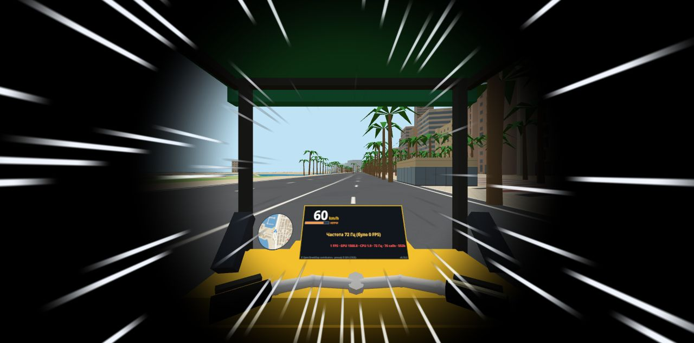
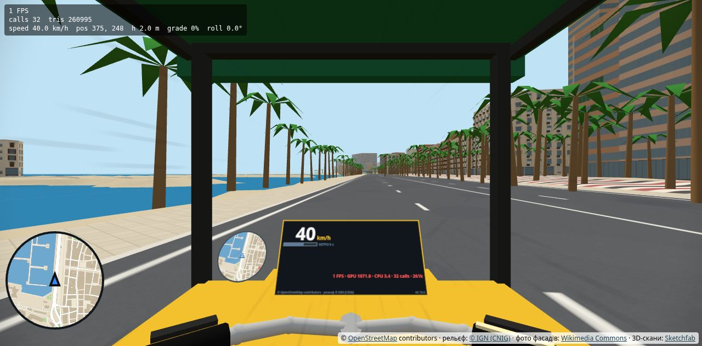

# Звіт: швидкості на схилах за твоїми даними і нітро (0.10.1)

Дата: 2026-09-30
Версія: **0.10.1**
Сайт: **https://archigreen55-prog.github.io/tuktuk-alicante-vr/?v=0.10.1**

## 1. Швидкості на підйомах і спусках

**Було (0.10.0):** на підйомі двигун мав постійну потужність, тож на 14 % виходило ~20 км/год. На спуску обмежувач давав 30 / 25 / 20 км/год залежно від ухилу.

**Стало:** на підйомі двигун тримає не більше швидкості з таблиці `TUNING.climbSpeed` у `src/vehicle/physics.js`. Одна постійна потужність не дає обидві твої точки разом: при 25 км/год на 14 % на 8 % виходило б 34. Потужність тепер лише обмежує, як швидко тук-тук розганяється на схилі. На спуску — 30 км/год на будь-якому ухилі від 4 % (між 2 і 4 % плавний перехід від 40 до 30).

Сталі швидкості на повному газу (перевірено в Node на рівному схилі):

| Ухил | Підйом | Спуск |
|---|---|---|
| 4 % | 40 | 30 |
| 8 % | 31 | 30 |
| 10 % | 30 | 30 |
| 12 % | 27.5 | 30 |
| 14 % | **25** | 30 |

Подія «Надто швидко на спуску!» (−5) тепер спрацьовує лише понад **35 км/год** на спуску крутішому за 4 %. Двигун сам понад 30 униз не їде, тож без нітро вона майже не з'являється.

**Підйом від MARQ до воріт** (автопілот, та сама фізика й рельєф):

| Водій | Від факту MARQ до зупинки біля воріт | Лише дорога вгору від підніжжя | Середня / макс. на підйомі | Макс. на спуску |
|---|---|---|---|---|
| Обережний | 3.4 хв | 2.9 хв | 17 / 28 км/год | 32 км/год |
| «Гід» (новий профіль: жвавий, але плавний) | **2.6 хв** | 2.2 хв | 22 / 32 км/год | 32 км/год |
| Різкий | 2.1 хв | 1.8 хв | 27 / 32 км/год | 32 км/год |

Твої 2.5–3 хв відповідають «гіду». Обережний довший, бо проходить повороти з бічним прискоренням 0.9 м/с².

**Зірки** (усі тури, обережний водій): до замку **5★** (настрій 100), короткий **5★** (95), повний **5★** (97). Різкий — 1★, як і раніше.

Одне спостереження, без змін у коді. «Гід» на турі до замку отримує лише 2★: 14 подій «швидкий поворот» на серпантині й у місті, на 25–30 км/год. Якщо ти так їздиш і пасажири в захваті, поріг «швидкого повороту» (зараз 3 м/с² бічного прискорення) можна підняти. Скажи, і я перекалібрую.

Граф маршрутів: ребра з ухилом понад 6 % тепер мають швидкість «житлової вулиці» (5.5 м/с). Ребра понад 12 % раніше мали 4 м/с. Цільовий час туру до замку став 22.1 хв замість 22.6.

## 2. Нітро

| | |
|---|---|
| Кнопка | **VR: права B (утримувати). Клавіатура: Shift** |
| Коли | лише коли їдеш уперед (від 3.6 км/год), не на задньому ході, не з ручником. Не спрацьовує й з A + B (повернення на дорогу) |
| Ривок | до `TUNING.nitroMaxKmh` = **60 км/год**, прискорення 5.5 м/с², до **4 с**, поки тримаєш кнопку |
| Перезарядка | **10 с** після кожного використання. Щоб запустити знову, треба заново натиснути кнопку |
| Після ривка | рівне сповільнення 2.5 м/с² до звичайних 40 км/год, без ривка |
| Тестування 60 → 80 → 100 | параметр адреси **`?nitro=80`**, `?nitro=100` (або змінити `nitroMaxKmh` у `TUNING`) |
| Індикатор | смужка під швидкістю на панелі: зелена «НІТРО» — готове, помаранчева «НІТРО!» — горить (скільки лишилось), сіро-синя «НІТРО 7 с» — перезарядка |
| Вільна їзда | завжди. На панелі «НІТРО! до 60 км/год» |
| Тур | можна, але туристи кричать **«ой»** (синтезовані голоси, по одному на туриста) і **−10 настрою** за кожне використання. На панелі «Ой! Нітро! −10». Нова фраза-відгук `nitro` у `data/tour.json`. Коли туристів у тук-туку ще немає, штрафу немає |

**Комфорт у VR під час нітро:**
- віньєтка-тунель щонайменше 0.6 навіть з налаштуванням «вимкнено». Нітро — найрізкіший рух у грі, тому я не даю його вимкнути. Скажи, якщо хочеш, щоб «вимкнено» вимикало і це;
- білі лінії швидкості по краях біжать назовні. Їх малює той самий прямокутник, що й віньєтку, тож без додаткових draw calls;
- нахил кабіни від нітро не змінюється: він як і раніше лише від дороги;
- на високій швидкості зменшено межу кутової швидкості повороту. Бічне прискорення не перевищує того, що було на 40 км/год.

**Удар об стіну на швидкості понад 50 км/год.** Якщо тук-тук ударився сильно (понад 4 м/с по нормалі до стіни), екран на 0.3 с стає чорним. Тук-тук за цей час стає на найближчу дорогу, у напрямку, в якому їхав (якщо вулиця двостороння). Стоїть на місці, кабіна одразу рівно на землі. Камеру не смикає: у VR вона закріплена в кабіні, а перенесення відбувається в темряві. Удари, що лише ковзають уздовж стіни на швидкості, аварією не вважаються. У турі діють звичайні штрафи: «Сильний удар» −25 і «Повернення на дорогу» −10.

**Колізії на такій швидкості.** Рух тепер ділиться на підкроки до 0.2 м з колізією після кожного. На 100 км/год за один крок фізики тук-тук проходить 0.39 м. Новий інструмент `node tools/test-collisions.mjs` кидає тук-тук з нітро на стіни будинків, на мури замку й міста і на берег. Швидкості 60, 80, 100 і 130 км/год, кути від 0 до 70° до стіни, по 300 кидків на кожне поєднання — разом 3600.

| | Кидків | Ударів | Аварій (понад 50 км/год) | Крізь стіну |
|---|---|---|---|---|
| Будинки | 1200 | 1074 | 1086 | **0** |
| Мури | 1200 | 685 | 686 | **0** |
| Берег | 1200 | 756 | 755 | **0** |

Аварій на 130 км/год трохи більше, ніж ударів: у тесті тук-тук не повертають на дорогу, тож він може вдаритись двічі. Для порівняння я запустив той самий тест без підкроків (`NOSUB=1`). Тоді теж 0 проходів крізь стіну: коло колізії 0.72 м більше за крок 0.5 м навіть на 130 км/год. Підкроки дають ще й запас у 2.5 раза.

## 3. Гудок перенесено

B тепер нітро. **Гудок у VR — правий стік уперед** (відхилити від себе, понад 60 % ходу). Він під великим пальцем в обох режимах, і з руками на кермі теж. Натиск правого стіка, як і раніше, перемикає режим керування. На клавіатурі гудок лишився на H. Стартовий екран і README оновлено.

## 4. Як перевіряли
- Сталі швидкості на ухилах і профіль ривка нітро 60 / 80 / 100 (Node, порожній світ).
- `tools/sim-tour.mjs`: усі 3 тури × обережний і різкий водії, плюс «гід» на турі до замку.
- `tools/test-collisions.mjs`: 3600 кидків, 0 проходів крізь стіну.
- Емулятор (Chrome + IWER):
  - розгін і нітро до 60 км/год, перезарядка 10 с, повторне натискання;
  - аварія на 80 км/год: затемнення й тук-тук на дорозі, поміщається;
  - тур: нітро з туристами дає настрій 100 → 90 і подію «нітро»;
  - у VR: нітро, віньєтка 0.6, лінії швидкості;
  - помилок у консолі немає.
- **Що не перевірено:**
  - звук «ой»: у headless-браузері звуку немає, послухай у шоломі;
  - вібрація;
  - FPS у шоломі.

## 5. Файли
- `src/vehicle/physics.js`:
  - таблиці підйому й спуску;
  - нітро;
  - підкроки руху;
  - виявлення аварії;
  - межа повороту на високій швидкості;
  - зона м'якої межі мапи, що росте зі швидкістю.
- `src/main.js`: нітро, аварія й повернення на дорогу, `?nitro=`, напрям після повернення, рівна кабіна після перенесення.
- `src/input/xrInput.js`, `src/input/keyboard.js`: B і Shift — нітро, гудок на правий стік уперед.
- `src/comfort/vignette.js`: мінімум 0.6 і лінії швидкості.
- `src/ui/dashboard.js`: індикатор нітро.
- `src/vehicle/horn.js`: «ой».
- `src/game/scoring.js`, `src/game/tour.js`, `data/tour.json`: подія нітро −10, фраза-відгук, поріг спуску 35 км/год.
- `tools/build-city.mjs` (швидкість крутих ребер), `data/city.json`.
- `tools/sim-tour.mjs` (профіль «гід», `onStep`), новий `tools/test-collisions.mjs`.
- `index.html`, `README.md`.
